<div align="center">



<p>
  
  
  
  
</p>

<a href="https://www.linkedin.com/in/abhishek-shukla-980a2b252" target="_blank"></a>
<a href="mailto:abhishrkshukla0852@gmail.com"></a>
<a href="https://leetcode.com/u/abhishekshukla7555" target="_blank"></a>

<br/>


</div>


### 🧠 About Me

```python
class AbhishekShukla:
    def __init__(self):
        self.role = "AI Engineer | Python Developer"
        self.education = "MCA @ Accurate Institute of Management and Technology"
        self.focus = ["RAG Pipelines", "LLM Applications", "AI Chatbots", "Multi-modal Systems"]
        self.leetcode_solved = "200+"
        self.location = "Noida, India"

    def currently_building(self):
        return "AI Meeting Assistant — Multi-modal RAG App 🎙️"
```

- 🔭 Currently building **RAG-based AI applications** with LangChain & vector databases
- 🌱 Deepening my skills in **LangGraph & multi-agent systems**
- 💬 Ask me about **RAG, Prompt Engineering, FastAPI backends**


### 🏆 DSA & Problem Solving

<div align="center">

</div>


### 🚀 Featured Projects

<table>
<tr>
<td width="50%" valign="top">
<h4>🎙️ AI Meeting Assistant</h4>
<p><em>Multi-Modal RAG Application — Deployed</em></p>
<p>Processes meeting audio/video & documents (PDF/DOCX/TXT), auto-generates transcripts, summaries & action items. Bilingual (Hindi/English) prompt logic with hallucination-safe fallback.</p>
<p>


</p>

<a href="https://ai-meeting-assistant-qradh5exk5lyxat4y4tvls.streamlit.app/">🔗 Live Demo</a>
</td>
<td width="50%" valign="top">
<h4>💬 AbhiChat — PDF Chatbot</h4>
<p><em>RAG-based AI Chatbot</em></p>
<p>ChatGPT-style bot that lets users upload a PDF and ask questions in natural language. Full RAG pipeline: ingestion → chunking → embeddings → semantic retrieval, served via FastAPI.</p>
<p>


</p>
</td>
</tr>
</table>


### 🧰 Technologies & Tools

<table>
<tr>
<td><strong>AI / LLM</strong></td>
<td>


</td>
</tr>
<tr>
<td><strong>Backend</strong></td>
<td>

</td>
</tr>
<tr>
<td><strong>Frontend</strong></td>
<td>

</td>
</tr>
<tr>
<td><strong>Tools & Platforms</strong></td>
<td>

</td>
</tr>
</table>


### 🐍 Contribution Snake

<div align="center">

</div>


